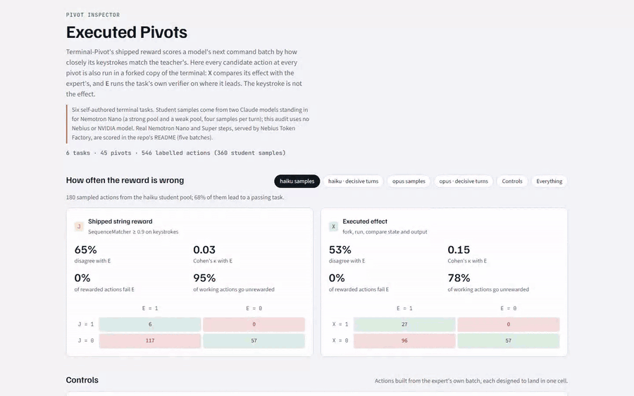
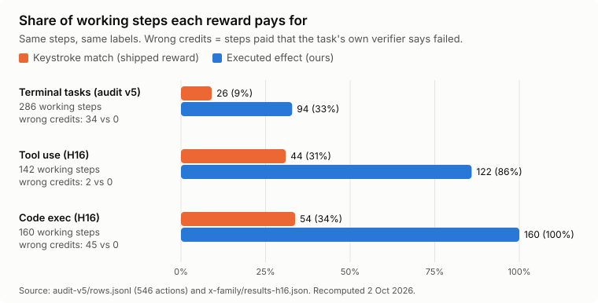
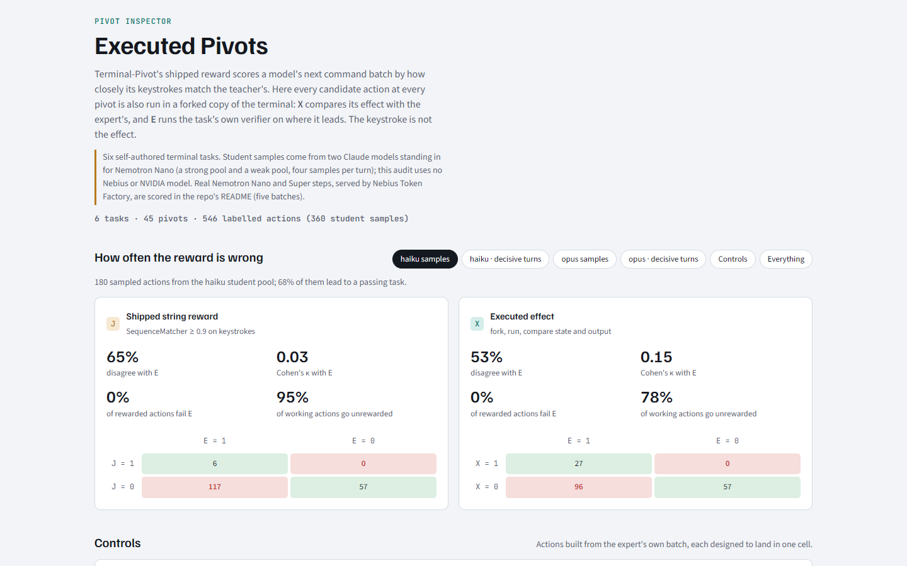
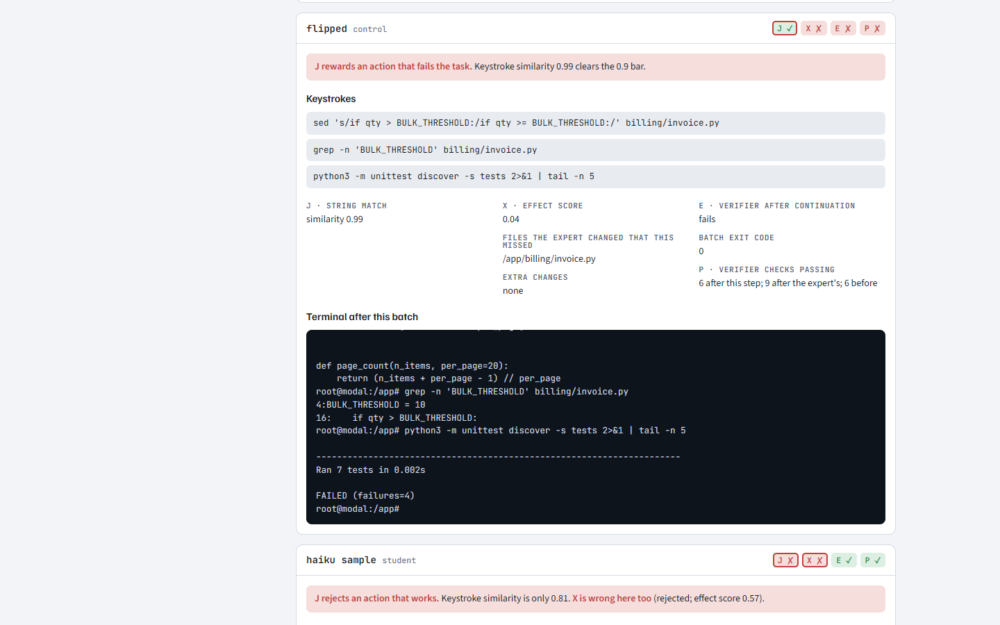
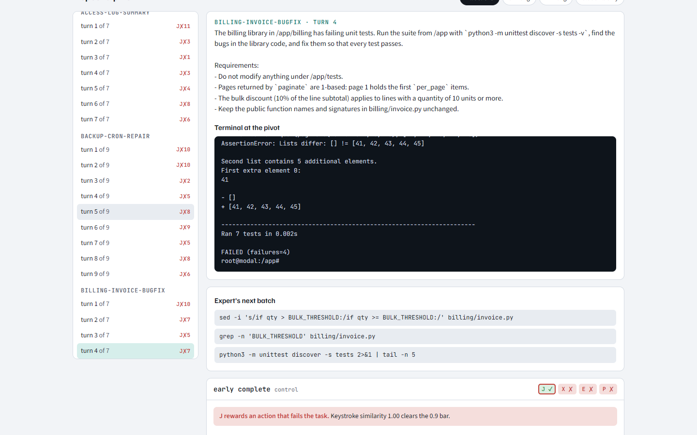
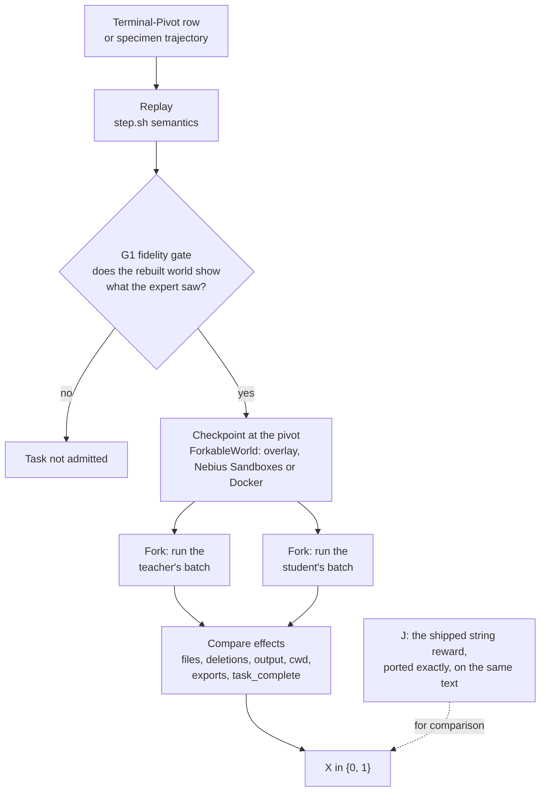

<p align="center">
  <a href="https://www.usebastion.io"></a>
</p>

<h1 align="center">Executed Pivots</h1>

<p align="center"><b>Reward an agent's terminal step by what it did, not by what it typed.</b></p>

<p align="center">
  <a href="LICENSE"></a>
  
  
  
  <a href="https://naidx0.github.io/executed-pivots-public/"></a>
</p>

<p align="center">
  <a href="https://naidx0.github.io/executed-pivots-public/"></a>
</p>

<p align="center">
  <a href="https://naidx0.github.io/executed-pivots-public/"><b>Open the Pivot Inspector</b></a> ·
  <a href="#quickstart">Quickstart</a> ·
  <a href="#results-at-a-glance">Results</a> ·
  <a href="RESEARCH.md">Research log</a> ·
  <a href="https://www.usebastion.io/#research">Bastion research</a>
</p>

NVIDIA's Terminal-Pivot data trains terminal agents with a reward that compares keystrokes with a teacher's.
These two commands differ by three characters, and that reward pays both:

```
sed -i 's/if qty > BULK_THRESHOLD:/if qty >= BULK_THRESHOLD:/' billing/invoice.py   # fixes the bug
sed    's/if qty > BULK_THRESHOLD:/if qty >= BULK_THRESHOLD:/' billing/invoice.py   # prints the file, changes nothing
```

Executed Pivots forks the terminal at that moment, runs both steps, and compares their effects.
It pays the first and not the second.



On 546 labelled actions it pays 94 working steps where the keystroke reward pays 26, and it pays 0 failing
steps where the keystroke reward pays 34. The same holds on two other agent task families (tool use, code execution).

**Try it without installing anything:** [Pivot Inspector](https://naidx0.github.io/executed-pivots-public/) shows every
step, both rewards and what actually ran.

## Results at a glance

J is the reward that ships with Terminal-Pivot (keystroke similarity). X is this repository's executed
reward. E is the truth: the task's own verifier after the step.

| What was measured | J (keystrokes) | X (executed) | n | Source |
|---|---:|---:|---|---|
| Steps where the reward agrees with E, Terminal-Bench | 96 | **176** | of 292 steps on 12 third-party tasks, p = 1.6e-20 | [H50](#terminal-bench-a-second-task-family-h50) |
| Steps where the reward agrees with E, Nemotron Super | 55 | **88** | of 176 steps, 0 false credits either side | [H40](#every-real-policy-batch) |
| Working student actions paid | 26 | **94** | of 286 working actions (E = 1), v5 audit | [v5 audit](#audit-with-claude-stand-ins-v5) |
| Failing control actions paid | 34 | **0** | 186 controls built to fool a string match | [v5 audit](#audit-with-claude-stand-ins-v5) |
| Labels matching the local runner, in Nebius Sandboxes | | **217 / 218** | stored demo steps, median 3.6 s per step, $0.80 | [H32, H34](#nebius-sandboxes-as-the-step-runner-h32-h34) |

This is a labelling result, not a training result: no policy has been trained on either reward yet.
The [caveats](#audit-with-claude-stand-ins-v5) and the [discards](RESEARCH.md) are listed in full.

## Screenshots

From the [Pivot Inspector](https://naidx0.github.io/executed-pivots-public/), one static page built from the audit.

<table>
  <tr>
    <td width="50%"><a href="docs/media/inspector-verdicts.png"></a><br><sub><b>How often each reward is wrong.</b> J and X against the verifier, per sample pool, with the full confusion table.</sub></td>
    <td width="50%"><a href="docs/media/inspector-flipped.png"></a><br><sub><b>One flag removed.</b> <code>sed</code> without <code>-i</code>: similarity 0.99, so J pays. The file never changed, so X does not.</sub></td>
  </tr>
  <tr>
    <td colspan="2"><a href="docs/media/inspector-pivot.png"></a><br><sub><b>Every pivot, inspectable.</b> The task, the terminal at the pivot, the expert's next batch, then every candidate with its keystrokes, effect and terminal output.</sub></td>
  </tr>
</table>

## Quickstart

```bash
git clone https://github.com/naidx0/executed-pivots-public && cd executed-pivots-public
python -m venv .venv && . .venv/bin/activate && pip install -e '.[dev]'
python -m pivots.audit.run specimens/billing-invoice-bugfix --out out/billing   # labels 30 actions in about 20 s
```

Linux or WSL2, Python 3.11+. No Docker, no GPU, no API key.

## How we know (the research loop)

Every claim here came from a pre-registered test: a win condition written down before the run, a sealed
baseline (same rows, same seeds), and a keep or discard decision logged either way. The cloud ledger has 19 tests (H1 to H18):
6 kept, 9 discarded, 4 paused or stopped. Tests H19 to H51 ran on a local machine; their results are summarised in [RESEARCH.md](RESEARCH.md). The discards are listed in [RESEARCH.md](RESEARCH.md) so nobody
retries them. [program.md](program.md) lets you run the same loop on the reward yourself.

## The keystroke is not the effect

[Terminal-Pivot](https://huggingface.co/datasets/nvidia/Nemotron-RL-Agentic-Terminal-Pivot-v1) has 31,111 rows
from 630 seed tasks. Each row is a terminal session cut at one expert turn: the history so far, and the teacher's
next command batch as the answer. The reward that ships with it (NeMo Gym's `terminus_judge`, string-only config)
joins the keystrokes of the student's batch and of the teacher's, computes `difflib.SequenceMatcher` similarity,
and pays 1 when the ratio is at least 0.9. The LLM judge is off. Nothing is executed, and the dataset ships no
environments to execute in.

Here is one pivot from our audit: `billing-invoice-bugfix`, turn 4 of 7. Four unit tests are failing and the
teacher fixes the discount threshold.

| | Keystrokes (first command of the batch) | String similarity | Shipped reward | What happened when it ran |
|---|---|---|---|---|
| Teacher | `sed -i 's/if qty > BULK_THRESHOLD:/if qty >= BULK_THRESHOLD:/' billing/invoice.py` | 1.00 | 1 | `invoice.py` fixed; verifier checks passing go from 6 to 9 |
| Candidate | `sed 's/if qty > BULK_THRESHOLD:/if qty >= BULK_THRESHOLD:/' billing/invoice.py` | 0.99 | **1** | `sed` without `-i` prints the file and changes nothing; the suite still reports `FAILED (failures=4)`; checks stay at 6 |

The candidate is a control we generate from the teacher's batch ("flipped": one flag removed). The rest of the
batch is identical. The shipped reward pays it. Executed Pivots' executed reward, X, scores it near zero (0.04 in the v5 audit rows, 0.00 on current X) and pays 0,
because the one file the teacher changed was not changed.

It also goes the other way. At `ledger-git-revert` turn 4, one student sample typed
`GIT_EDITOR=true git revert cdf209b` where the teacher typed `git revert --no-edit cdf209b`. Similarity 0.70, so the
shipped reward pays 0. The revert commit is made either way, and the verifier's passing checks go from 9 to 12
after either step. X pays 1.

## How it works



- **Audit:** J, X and ground-truth labels for every action.
- **Gym server:** X behind `/verify`.
- **Inspector:** one HTML page over an audit run.

**World backends** (`cleave/world/`). One contract, `ForkableWorld` in `base.py`: `checkpoint`, `fork`, `run`,
`put`, `get`. Checkpoints are immutable ids and forks start from them.
- `overlay.py`: no Docker daemon. Linux user namespaces plus overlayfs, with the host root as the base image. A
  checkpoint is the tuple of layer directories, so a fork copies nothing. Measured at 0.1 to 0.3 s per run on a
  4-core cloud container. Network is off by default and the host is never written. It is built for correctness,
  not as a security boundary against hostile code. Linux or WSL2 only.
- `contree.py`: Nebius Sandboxes (ConTree) on `contree-client` 0.4.0. The platform has no fork call, so an image
  uuid is the checkpoint and a fork is a new spawn from that uuid. It uses the client directly because
  `contree-sdk` 0.3.6 cannot turn networking off per run. Tested against the client's in-memory test double only.
- `nebius.py`: Nebius Sandboxes on `contree-sdk`, used as an opt-in step runner. This one has run live: all 218
  stored demo steps, 217 of 218 labels identical to the local runner, 0 false credits, $0.80, median 3.6 s per step.
  It has no network switch and no local jail; the sandbox is the boundary. A spend guard stops on any billing,
  quota, 402, 403 or 429 error. Local stays the default.
- `docker.py`: the reference backend. Its tests skip when no daemon is running.

**Replay and G1** (`pivots/replay/`). `step.py` runs one Terminus-2 batch the way the harness types it: all
commands in one shell, heredoc-aware splitting, the prompt echoed in the recorded `root@host:cwd#` shape, and cwd
and exported variables carried across checkpoints in `/var/lib/xp`. `fidelity.py` is gate G1: normalise volatile
text (timestamps, PIDs, hex, hostnames, sizes), compare the replayed output with the recorded output turn by turn,
and admit a task only when at least 95% of turns score 0.9 or more and no turn errors where the original succeeded.

**J and X** (`pivots/effect/`). `jreward.py` is a port of `terminus_judge_string_only` from NeMo Gym, kept as the
baseline. `xreward.py` runs the teacher's batch and the candidate's batch from the same checkpoint and compares
files created, modified and deleted (by content hash), the normalised terminal output, the final cwd and the
exported environment. Penalties cover side effects the teacher did not cause, destructive deletes, new errors,
timeouts, shell-state divergence and a premature `task_complete`. Reward is 1 at a score of 0.75 or more. A GRPO
group of G candidates costs G+2 sandbox runs and no model calls.

Changes to X since the first audit, each kept only after it held 0 false credits on every stored set:
- A source file the teacher edited by hand must match, or X is 0. Generated files (build/, dist/, site-packages
  and the like) no longer outvote it (H20).
- The npm global prefix and `/usr/local/bin` are always watched, counting only files whose bytes differ from the
  pivot. This closed four hand-written attacks on an installed package copy (H29).
- At a read-only pivot, the output is scored by recall of the teacher's paths, identifiers, numbers and error
  names, not by whole-output similarity. +12 working credits; 0 of 14 read-only decoys paid (H30). Line-number
  prefixes are stripped first: +4 on a fresh batch, 0 of 20 decoys paid (H38).
- No cwd penalty when the teacher's next step resets the cwd with an absolute `cd` or is a bare claim: +2 (H39).
- The site-packages of a venv that exists at the pivot are watched, and a file the teacher's step creates must
  match byte for byte. This closed 3 hand-written false credits (H42).
- Multi-reference X: a step the teacher comparison misses is credited if it matches an earlier policy action
  verified at the same pivot (E = 1 and P = 1), under the same rules (H44). It is on when a `references.jsonl`
  sits next to the anchors.

Hand-written attacks are now required. A generated red team of 51 attacks found no false credit in one X change
(H22). 11 hand-written attacks then found 7 on 9 qualifying steps, and the change was reverted (H23). Every new
specimen now needs at least 10 hand-written wrong steps, all at X = 0. Hand-written wrong steps found three holes
in X: an npm package copy under node_modules (H24), pip changes inside a venv's site-packages, and a created file
with the wrong bytes (H41). Each was closed: H29 for the first, H42 for the other two.

**Audit** (`pivots/audit/`).
- `controls.py` builds six controls from every teacher batch: expert, paraphrase, flipped, no_op, destructive and
  early_complete.
- `run.py` labels every action with J, X and E. E forks the pivot, runs the action, replays the teacher's remaining
  turns open loop and runs the task's verifier.
- `progress.py` adds P, a label that needs no continuation model. P is 1 when at least as many verifier checks pass
  right after the step as after the teacher's step, and a `task_complete` claim is true.
- `closed_loop.py` keeps episodes on disk so any external policy can continue from the state a candidate left.
- `prompts.py` writes the exact Terminus-2 prompt a student sees at each pivot.

**NeMo Gym resources server** (`resources_servers/executed_pivot/`, core in `pivots/gym/core.py`). A drop-in for
`terminus_judge_string_only` on Terminal-Pivot rows. `/verify` returns the reward, the continuous effect score,
the penalties applied, and `j_reward` (what the string judge would have paid). Environment failures set
`mask_sample: true` so the trainer drops the sample instead of learning from an infrastructure error. Upstream Gym
has no Nebius Sandboxes provider; this server brings its own backend.

**Pivot Inspector** (`pivots/report/inspector.py`). One self-contained HTML file over an audit run: the verdict
cards for J and X, the control table, and every pivot with the terminal before it, the teacher's batch, and each
candidate's keystrokes, chips, effect detail and terminal output. It can be hosted anywhere as a static page.

**Specimens** (`specimens/`). Sixteen small terminal tasks with known ground truth, 139 pivots in all, with
verifiers that check outcomes rather than commands. The first six (a Python bug fix, a data pipeline, a cron
repair, a git revert, awk log reports and a C Makefile fix) have 7 to 9 teacher turns each and offline verifiers.
Ten more ship a real Dockerfile: a pyproject install, a sqlite dedupe, a jq rollup, an npm package, a Go build,
pip constraints, shell log rotation, SQL migrations, an INI config with a systemd unit, and a Perl MakeMaker dist.

## Full setup

Needs Linux or WSL2 with unprivileged user namespaces and overlayfs, and Python 3.11 or newer. Runs as a normal
user; no sudo, no Docker.

```bash
git clone https://github.com/naidx0/executed-pivots-public && cd executed-pivots-public
python -m venv .venv && . .venv/bin/activate
pip install -e '.[dev]' contree-client

# Tests. Some skip without a Docker daemon, NeMo Gym main, FastAPI for the demo, or Linux
python -m pytest tests -q

# Validate the six specimens: gold passes 3x, no-op fails, partial states fail, replay is identical 3x (about 90 s)
python3 specimens/validate.py

# Audit with the generated controls only (no model needed), then add the P label and build the Inspector
python -m pivots.audit.run specimens/* --out out/audit
python -m pivots.audit.progress specimens/* --audit out/audit --out out/audit/progress.jsonl
python -m pivots.report.inspector out/audit --out out/inspector.html
```

The audit takes about 2.5 minutes on 4 cores and the P label about 1 minute. These times and counts are for the
six original specimens. The five Dockerfile specimens need their own tools (npm, Go, jq, sqlite3 and so on), so run
them in the image their Dockerfile builds. The page built here holds the 186 controls only. The demo Inspector is the same build over the full audit, which adds the 360 student samples.

To audit a model, write its prompts, sample it, and pass the samples in. Each JSONL row is
`{"task", "turn", "text", "pool"}`: `task` and `turn` as in the prompt file (turns count from 0), `text` the
model's Terminus-2 JSON response, and `pool` a name for the model.

```bash
python -m pivots.audit.prompts specimens/* --out out/prompts
# ... sample your model on out/prompts/<task>/<turn>.json into students.jsonl ...
python -m pivots.audit.run specimens/* --students students.jsonl --out out/audit
# then rerun the progress and Inspector commands above
```

Live demo ("try a step"): pick a decisive pivot, write the next batch, and see J, X and P side by side, with
your terminal next to the expert's. It runs as an ordinary user on Linux or WSL2; `pivots/demo/README.md` covers
Docker, hosting on a VM, the sandbox limits and the API.

```bash
scripts/demo.sh        # http://127.0.0.1:7860
```

The demo has run end to end from the `Dockerfile` image, as a non-root user with the hardened runner: 18 of 18
requests returned HTTP 200, and three real Nemotron Super steps that J rejects got X = 1, as in the lab labels
One throwaway CPU VM with Docker and Caddy is enough to host it; the Inspector is a static page.

Closed-loop episodes, driven by any policy in another process. `action.json` holds one Terminus-2 JSON response.

```bash
python -m pivots.audit.closed_loop init --audit out/audit --episodes out/eps --select decisive
python -m pivots.audit.closed_loop show out/eps/<id>.json
python -m pivots.audit.closed_loop step out/eps/<id>.json action.json
python -m pivots.audit.closed_loop summary --audit out/audit --episodes out/eps
```

NeMo Gym server. It needs NeMo Gym main, which needs Python 3.13.14 or newer, so it gets its own venv.
`requirements.txt` pins the Gym commit it was tested on, and uv fetches the Python if yours is older.

```bash
pip install uv && uv python install 3.13.15
uv venv --seed --python 3.13.15 .venv-gym && . .venv-gym/bin/activate
(cd resources_servers/executed_pivot && pip install uv -r requirements.txt)
python3 resources_servers/executed_pivot/scripts/prepare.py specimens/billing-invoice-bugfix --store /tmp/cleave-overlay-gym
gym env test +entrypoint=resources_servers/executed_pivot
gym env start --config resources_servers/executed_pivot/configs/executed_pivot_overlay.yaml \
    --config responses_api_models/openai_model/configs/openai_model.yaml \
    ++policy_base_url=<url>/v1 ++policy_api_key=<key> ++policy_model_name=<model>
```

`gym env test` passes 7 of 7. `gym env start` needs an OpenAI-compatible endpoint for the policy model. Without one,
`gym eval run` has run end to end with a stand-in policy that replays the audit's stored actions (630 rollouts): Gym's
rewards equal the X and J labels of the audit it ran against (v4) on all 546 actions. The server README's "Running a
rollout" has the commands.

`configs/executed_pivot.yaml` is the Nebius Sandboxes variant on `contree.py`. It needs a Sandboxes token and has not
been run live. The live Sandboxes runs used `nebius.py` (above).

Real-policy rollouts: `gym/run_local_policy.sh` builds the dataset (all 16 specimens, 139 pivots), sends each
pivot's prompt to an OpenAI-compatible endpoint, scores the reply with the same core `/verify` calls, and labels J,
X, E and P. `gym/README.md` has the commands. To score with multi-reference X, put a reference file such as
`data/references.jsonl` next to the anchors as `references.jsonl`; `resources_servers/executed_pivot/README.md`
documents the format.

## Results so far

### Every real-policy batch

Two rollouts per pivot, policies served by Nebius Token Factory, truth is E. X is the version that shipped when the
batch ran. "Only X / only J" counts the paired steps where one reward is right and the other wrong.

| Batch | Policy | Pivots | Labelled | Agrees with E: X / J | Only X / only J | Working credited: X / J, of E = 1 | False credits: X / J |
|---|---|---|---|---|---|---|---|
| H31 | Nemotron Nano | 89 | 176 | 99 / 83 | 16 / 0 | 32 / 16, of 109 | 0 / 0 |
| H37b | Nemotron Nano | 89 | 176 | 105 / 87 | 18 / 0 | 40 / 22, of 111 | 0 / 0 |
| H40 | Nemotron Super | 89 | 176 | 88 / 55 | 33 / 0 | 60 / 27, of 148 | 0 / 0 |
| H41 | Nemotron Super | 50 (5 new tasks) | 94 | 45 / 31 | 16 / 2 | 28 / 14, of 77 | 0 / 0 |
| H43 | Nemotron Nano | 139 | 270 | 156 / 136 | 21 / 1 | 46 / 26, of 160 | 0 / 0 |
| H45 | Qwen3-30B (not NVIDIA) | 139 | 270 | 172 / 122 | 52 / 2 | 88 / 40, of 186 | 0 / 2 |

- Nano is `nvidia/NVIDIA-Nemotron-3-Nano-30B-A3B`, Super `nvidia/nemotron-3-super-120b-a12b`, Qwen
  `Qwen/Qwen3-30B-A3B-Instruct-2507`. All but H45 are NVIDIA models.
- H37b is scored with its claim rules off, which is X as it ships. H45's X row is multi-reference X; with the
  teacher's step alone it is 146 / 122 agreement and 62 working credits.
- H41 was discarded on its hand-written wrong steps, not on these rollouts (see "How it works").

### Terminal-Bench, a second task family (H50)

12 of Terminal-Bench's easy tasks (third-party, Apache-2.0), each with its own Dockerfile, pytest verifier and
reference solution, ported with the verifiers unchanged (`specimens/tb-*`). 292 labelled rollouts from a small local
model (qwen3.5:4b), 4 per pivot, truth E from the task's own verifier:

| | J | X |
|---|---|---|
| Agrees with E, of 292 | 96 | 176 |
| Right where the other is wrong | 4 | 84 |
| Working steps paid, of 230 | 34 | 116 |
| Failing steps paid | 0 | 2 |

Paired sign test p = 1.6e-20. The 2 false credits are one pivot where the step sets the right files to the wrong
mode: X hashes bytes, not permission bits. Comparing modes is the next change under test.

### Multi-reference X (H44, H45)

X compared a step only with the teacher's one step, and most misses scored far below the threshold. H44 adds
earlier policy actions verified at the same pivot as references: 437 actions from H31, H37b, H40 and H41, over 120
of the 139 pivots. Only E = 1, P = 1 actions can be references.
- On the held-out H43 batch, working credits go from 46 to 77 of 160, with 0 false credits. In the safety sets
  (red team, hand-written wrong steps, decoys, wrong claims), no actually-wrong step is credited.
- On Qwen (H45), whose actions are not references, working credits go from 62 to 88 of 186, with 0 false credits.
  Only 4 of the 26 new credits repeat a reference's keystrokes.
- The gain comes from actions a policy has been verified doing before. A new task has no references.

### Nemotron Nano rollouts (H31)

**Setup.** Policy `nvidia/NVIDIA-Nemotron-3-Nano-30B-A3B` through Nebius Token Factory, temperature 1.0 and top_p
0.95. Two rollouts at each of the 89 pivots of the 11 specimens: 178 rollouts, 176 labelled. The other 2 are
masked because the teacher's own step does not reproduce there. 178 requests, 0 upstream errors. The step ran on
the local runner, through the `direct` driver, which calls the core behind the Gym server's `/verify`. Truth is E.

| | J, shipped string reward | X, executed effect |
|---|---|---|
| Agrees with E, of 176 | 83 | 99 |
| Right where the other is wrong | 0 | 16 |
| Working steps credited, of 109 (E = 1) | 16 | 32 |
| Failing steps credited (E = 0) | 0 | 0 |

The paired sign test gives p = 3.1e-5. On a fresh batch (176 labelled, new samples, the same X), X agrees with E on
105 and J on 87; X alone is right 18 times, J never, and neither pays a failing step. X credits 40 of 111 working
steps there.

X still misses most working steps: 77 of 109. We re-ran 59 of 68 parsed misses with full detail (the other 9 were
sorted offline) and sorted all 68 by cause. 23 are about completion claims; most of the rest are exploration steps
that differ from the teacher's. Two rules for claims added only 5 credits on fresh data (8 needed), so they were
reverted (H37, H37b). Multi-reference X (above) is what has moved recall most since.

### Nebius Sandboxes as the step runner (H32, H34)

All 218 stored demo steps ran in Nebius Sandboxes. 217 of 218 J, X and P labels match the local runner, with 0
false credits, for $0.80 (1065 s). The one difference is a read-only `ls -la` step whose timestamps differ; X
fails safe there. The first run matched 214. Three of its differences came from HOME being unset in the sandbox,
so git lost its identity. HOME now defaults to `/root`.

### Audit with Claude stand-ins (v5)

**Setup.** 6 specimen tasks, 45 pivots. At each pivot, 4 samples from each of two Claude models (pools `opus` and
`haiku`) standing in for Nemotron Nano: 360 student actions. Plus 186 generated controls: 546 actions, labelled in
about 17 minutes on a 4-core CPU container. Ground truth is E (open-loop continuation, then the task's verifier)
and P (verifier checks right after the step). The two agree on 92.9% of actions, and every headline below holds
under either.

| | J, shipped string reward | X, executed effect |
|---|---|---|
| Working student actions credited, of 286 (E = 1) | 26 (9%) | 94 (33%) |
| Working student actions credited, of 310 (P = 1) | 26 (8%) | 94 (30%) |
| Failing student actions credited | 0 | 0 |
| Failing control actions credited | 34 | 0 |
| Decisive turns, `opus` pool: working actions credited, of 52 | 4 | 26 |
| Decisive turns, `haiku` pool: working actions credited, of 17 | 0 | 8 |

Decisive turns are the 17 pivots where skipping the teacher's step makes the task fail (with the teacher's
remaining turns replayed after it).

| Control (built from the teacher's batch) | n | J = 1 | X = 1 | E = 1 |
|---|---|---|---|---|
| expert | 45 | 45 | 45 | 45 |
| paraphrase | 12 | 11 | 12 | 12 |
| flipped (one flag or operator changed) | 6 | 6 | 0 | 0 |
| early_complete (teacher's keystrokes, claims done) | 39 | 39 | 0 | 11 |
| no_op | 39 | 0 | 0 | 22 |
| destructive | 45 | 0 | 0 | 1 |

On these samples the shipped reward is safe but starved: it never paid a failing student action, and it paid only
near-copies of the teacher. On controls built to fool a string match it paid 34 failing actions: all 6 flipped
batches, and 28 early `task_complete` claims (its completion check only runs one way). X paid none of them.

**Task success is a poor per-step truth.** We also graded the 17 decisive turns by letting a model finish the task
from the state each action left (170 episodes per run). A strong continuation passed 17 of 17 after the teacher's
step, 17 of 17 after doing nothing, and 136 of 136 after student steps. A weak one passed 13 of 17, 12 of 17 and 101
of 136. Either way the outcome tracks the continuation model, not the step. That is why X judges the step by its
own effect.

X has changed since this audit (H20, H29, H30). On the 322 v5 rows kept on this machine, each change was
re-measured: false credits stayed 0, and working credit went 91 to 89 (H20) and 89 to 94 (H30).

**Caveats.**
- In this audit the students are Claude models. The real-policy batches above are 94 to 270 labelled steps each.
  Every task is one we wrote, not a rebuilt Terminal-Pivot task.
- X is conservative. It rewards equivalence with the teacher's step (or a verified reference), so a different but
  useful step scores 0. It left 192 of 286 working student actions unrewarded here, 77 of 109 working Nemotron steps
  in H31, and 98 of 186 on Qwen with references (H45).
- No policy has been trained on X or J.
- E replays the teacher's remaining turns open loop, which can over- or under-credit an action. P and the
  closed-loop runs are there to check it.
- In the weak closed-loop runs, the continuation workers reused one script across many episodes instead of
  reading each state.
- Rebuilding tasks from transcript text alone (E0) passed G1 on 0 of 6 specimens. Real tasks need their
  environments, not just their histories.

## Roadmap

1. Real Terminal-Pivot tasks: build their environments and admit each through G1 before any label counts. Then
   Nemotron Nano rollouts at those pivots.
2. Higher X recall without new false credits. Completion claims are the largest named cause of misses; references
   do not help on a task no policy has been verified on yet.
3. Nebius Sandboxes as the default runner, once a run can switch networking off. The documented beta limit of 50
   concurrent operations sets the rollout width.
4. A paired per-step truth: the same continuation from the student's state and from the teacher's state, scored by
   the difference.
5. Real-model rollouts through the Ray-served `gym eval run` path, and a ConTree `SandboxProvider` for NeMo Gym.
6. A training arm on Nebius AI Cloud: executed reward against string reward on the same pivots. The 520 GPU-hour
   H200 plan costs $2,340 at the current $4.50 per GPU-hour, or $2,808 at $5.40 from 1 October 2026. Not funded yet.

## License

Apache-2.0. The specimens are original to this repo. Terminal-Pivot is CC-BY-4.0 and is not redistributed here.

---

<p align="center">
  <a href="https://www.usebastion.io"></a><br>
  <sub>Executed Pivots is <a href="https://www.usebastion.io/#research">research from Bastion</a>, built for the Nebius hackathon.</sub>
</p>
